View <a href="https://github.com/stuhdy-cubby">stUHdy cubby</a> project on GitHub


## Table of Contents
* [Overview](#overview)
* [Deployment](#deployment)
* [User Guide](#user-guide)
* [Developer Guide](#developer-guide)
* [Example Enhancements](#example-enhancements)
* [Development History](#development-history)
* [Community Feedback](#community-feedback)
* [Team](#team)

## Overview
### The Problem
ICS students often spend more time than they need on their homework and don’t learn the material as effectively as they could, because they study alone and do not leverage the power of face-to-face study groups with peer mentors.

### The Solution
stuhdy cubby is an application for UHM ICS students to self-organize face-to-face study groups around a course and/or specific homework or project topic.

## Deployment
A live deployment of stUHdy cubby can be found at [https://stuhdy-cubby.xyz/#/](https://stuhdy-cubby.xyz/#/).

## User Guide
The user guide provides a walkthrough of each page of stUHdy Cubby and its user interface features.
* [Landing page](#landing-page)
* [Sign in page](#sign-in-page)
* [Sign up page](#sign-up-page)
* [404 page](#404-page)
* [User home page](#user-home-page)
* [Admin home page](#admin-home-page)
* [User profile page](#user-profile-page)
* [Edit Profile page](#edit-profile-page)
* [Calendar page](#calendar-page)
* [Create Study Sesh page](#create-study-sesh-page)
* [List session page](#list-session-page)
* [Register session page](#register-session-page)
* [Profiles page](#profiles-page)
* [Leaderboard page](#leaderboard-page)


### Landing page
The user is greeted with a simple landing page with a brief introudction about the features of stUHdy cubby.


### Sign in page
The sign in page allows the user to login with an existing account.
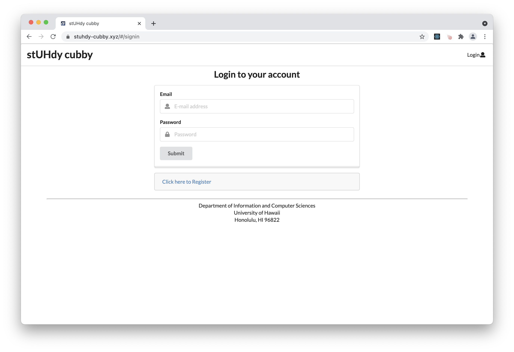

### Sign up page
The sign up page allows the user to create a new account if they don't already have one. To this, click on "Login" then "Sign up." Only an email and password are required for a new account.
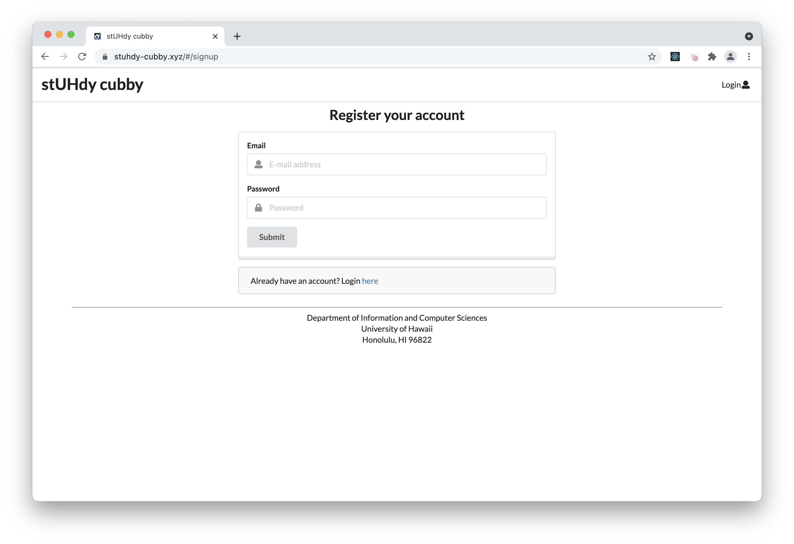

### 404 page
The 404 page appears when a page cannot be found.
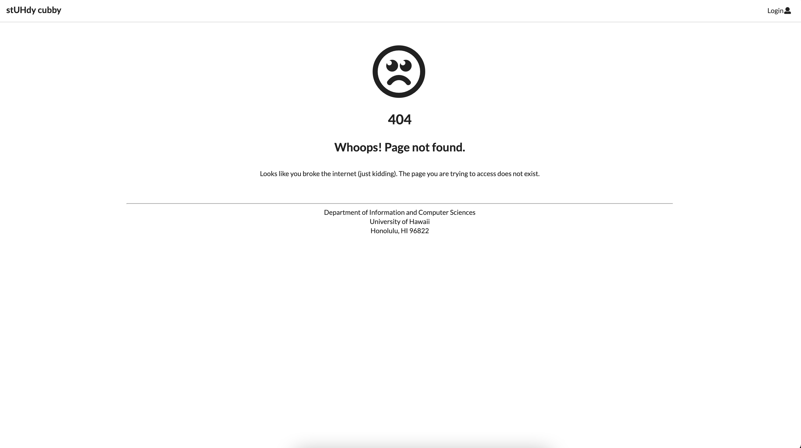

### User home page
When a user successfully logs into their stUHdy cubby account, they have access to all the feature the app has to offer to ICS students looking to study. The nav bar includes the ability to view a list of sessions, calendar, add session, leaderboard, courses list, and profiles. The nav bar also allows the user to click on the email to view or edit their profile.
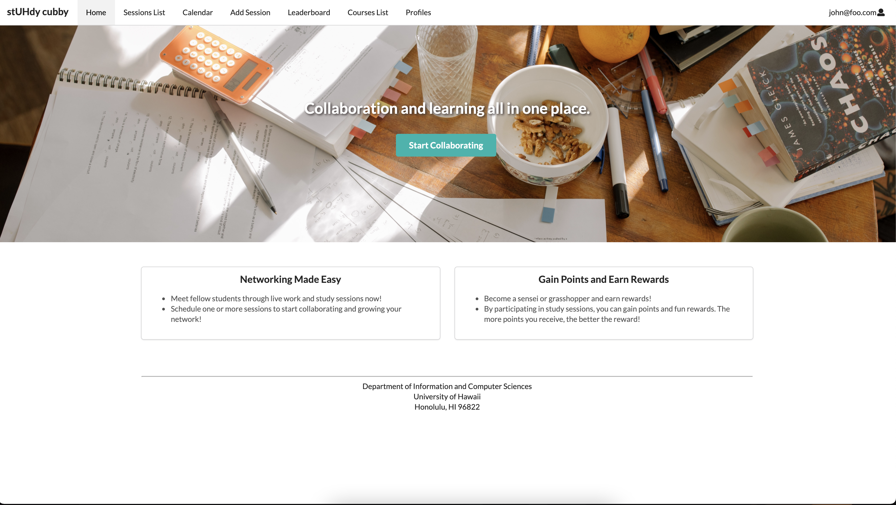

### Admin home page
The admin home page is where the admin can view all current and past sessions as well as their own created sessions.
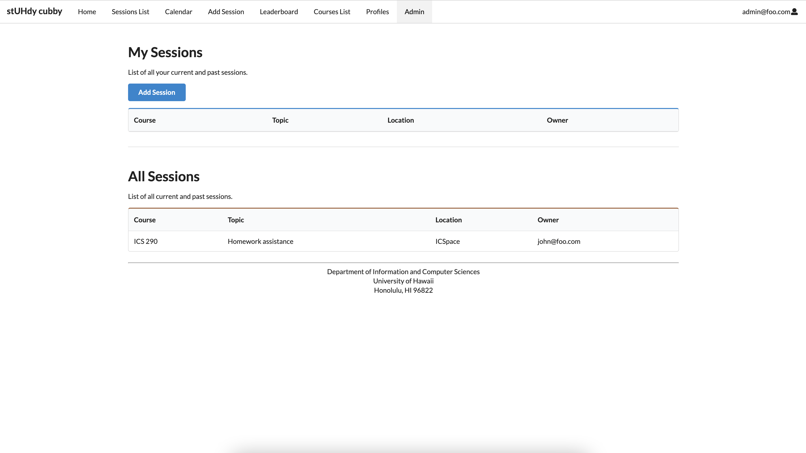

### User profile page
The user profile page contains information about the user. It is divided up into three sections. The left side contains the user's basic information such as name, email, school, major, and class standing. The middle section dispalys the user's course and if they are a sensei(tutor) or grasshopper(tutee) of a course. This section also shows the skills the user possess. Lastly, the right section has the user's interests and study sessions thhey are attending. 

Users also has the option to edit their profile and edit courses on this page.
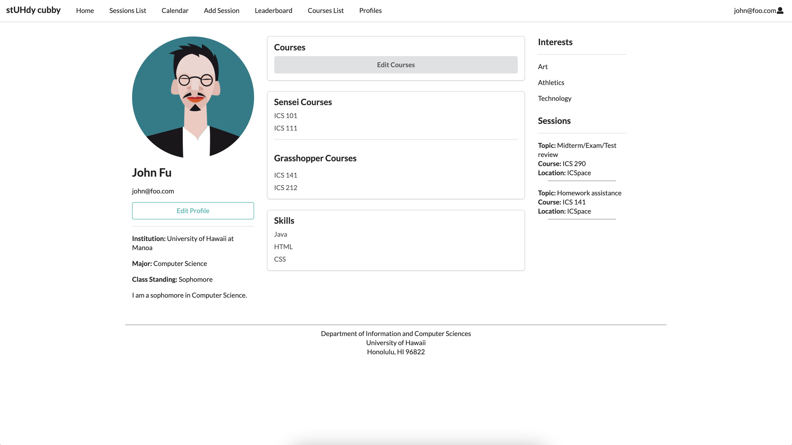

### Edit Profile Page
The edit profile page gives the user the ability to change information about themselves that are displayed on their profiles.
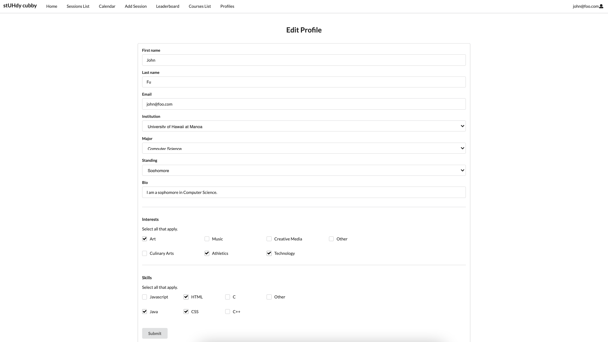

### Edit Course page
The edit course page is where the user can add or remove sensei or grasshopper courses to let others know what courses they are willing to help others with or courses they need assistance in.
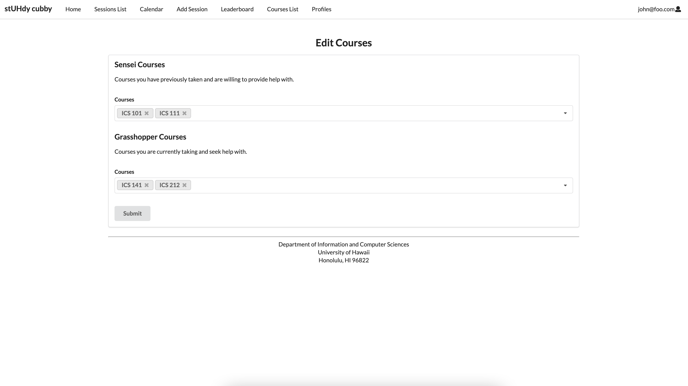

### Calendar page
The calendar page allows the user to view a calendar containing study session events. The user can click on the event to show more info about the event and to register for that session.
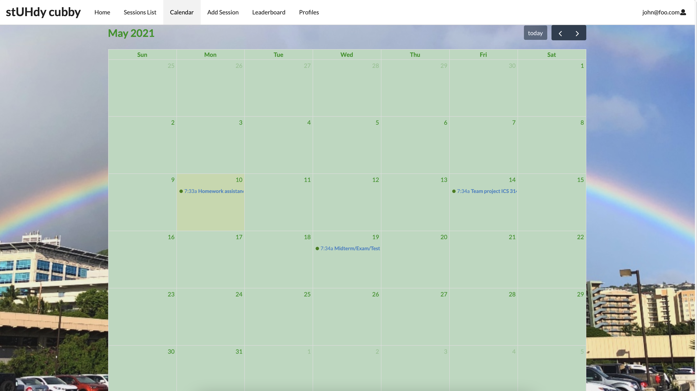

### Create Study Sesh page
The add study session page is where the user can create a study session for students to participate in. They input information such as topic, course, location, date, and session notes. When a session is created, an email notification will be sent out.
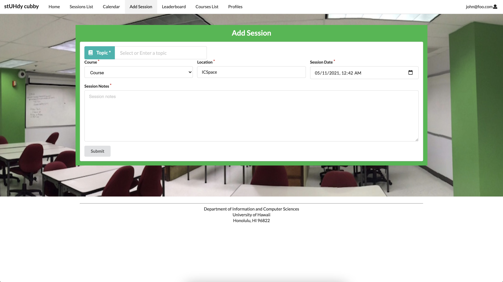

### List session page
Once a study session has been created, the session appears on the sessions list page. Users can see information about a session as well as register for one. They will also be allowed to see a list of participants in a session


### Register session page
A user can register for a session by clicking on an event on the calendar or clicking register on the sessions list page. From there, they will be taken to the register for session page. The user enters their response and submits the form to successfully register for a study session.
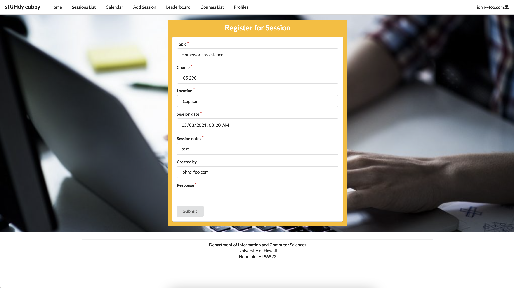

### Profiles Page
The profiles page allows users to view current profiles.
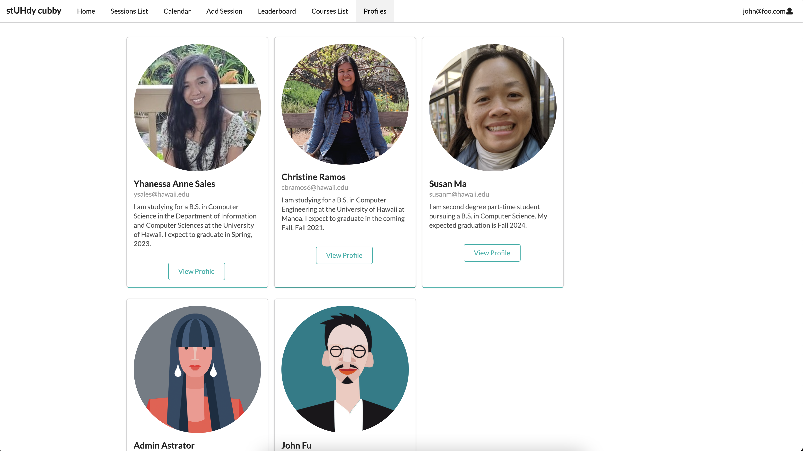

### Leaderboard page
The leaderboard page encourages students to register and attend study sessions. A user will earn one point for every session they register or create. The user with the highest points will be displayed on the top of the leaderboard to let everyone know.
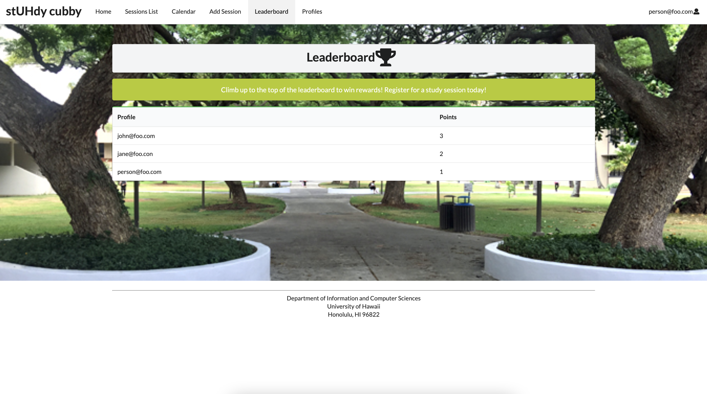

## Developer Guide

Step 1: Install <a href="https://www.meteor.com/developers/install">Meteor</a>

Step 2: Download a copy of <a href="https://github.com/stuhdy-cubby/stuhdy-cubby">copy of stUHdy cubby</a>

Step 3: cd into the app directory and install required libraries with: ```meteor npm install```

Step 4: Run application with: ```meteor npm run start```

Steo 5: If steps 1-4 were successful, <a href="http://localhost:3000/">http://localhost:3000</a> should appear and allow you access to the digits application. You can either regesiter with a new account or use the login credentials found in settings.development.json

Step 6: With ```meteor npm run lint``` you can run ESLint on the code to check for any errors in the imports/directory.

## Development History
The development process for stUHdy cubby conformed to [Issue Driven Project Management](http://courses.ics.hawaii.edu/ics314s21/morea/project-management/reading-guidelines-idpm.html) practices. In a nutshell:

* Development consists of a sequence of Milestones.
* Each Milestone is specified as a set of tasks.
* Each task is described using a GitHub Issue, and is assigned to a single developer to complete.
* Tasks should typically consist of work that can be completed in 2-4 days.
* The work for each task is accomplished with a git branch named “issue-XX”, where XX is replaced by the issue number.
* When a task is complete, its corresponding issue is closed and its corresponding git branch is merged into master.
* The state (todo, in progress, complete) of each task for a milestone is managed using a GitHub Project Board.

## Testcafe
Testcafe was used to test the project pages.

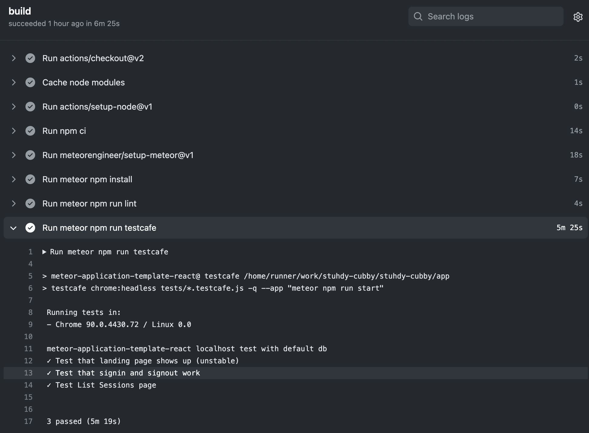

### Milestone 1
The goal of Milestone 1 was to create a set of mockup pages providing an overall mockup of the project.

Milestone 1 was managed using [stUHdy cubby GitHub Project Board M1](https://github.com/stuhdy-cubby/stuhdy-cubby/projects/1).

### Milestone 2
The goal of Milestone 2 was to create functional pages of the project.

Milestone 2 was managed using [stUHdy cubby GitHub Project Board M2](https://github.com/stuhdy-cubby/stuhdy-cubby/projects/2).

### Milestone 3
The goal of Milestone 3 was to design pages of the project to fully finish the web application.

Milestone 3 was managed using [stUHdy cubby GitHub Project Board M3](https://github.com/stuhdy-cubby/stuhdy-cubby/projects/3).

### Project Board
[M1](https://github.com/stuhdy-cubby/stuhdy-cubby/projects/1)

[M2](https://github.com/stuhdy-cubby/stuhdy-cubby/projects/2)

[M3](https://github.com/stuhdy-cubby/stuhdy-cubby/projects/3)

## Example Enhancements
* Text message interface. See notifications, and reply to confirm attendance all through text message.
* Slack integration to facilitate notification and organization of meetings.
* A Slack Bot to suggest and help implement Study Buddy meetings.
* A rating system for meetings and sensei participation.

## Community Feedback
Tester 1 (Joy):
* edit profile - allows me to save with placeholder options (ex: institution, major, standing)
* if you're already logged in,why does home > start collaborating take you to the login screen?
* Sessions List - if there are no sessions to register for, perhaps a message should say that
* Add Session - able to add session in the past
* Register for Session - fields that are read only should be disabled/greyed out
* Register for Session - after registering, should it take me back to the Sessions List?
* Register for Session - should not allow same user to register multiple times
* New session email > included a register link for a session in the past and allowed me to register for it
* date/time does not appear to be consistent

Several issues raised were fixed after Tester 1 completed testing.

## Team
stuhdy cubby is designed, implemented, and maintained by [Susan Ma](https://susankpma.github.io/), [Yhanessa Sales](https://yhanessaanne.github.io/), and [Christine Ramos](https://christinebramos.github.io/).
