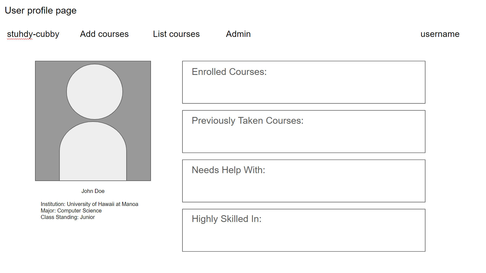
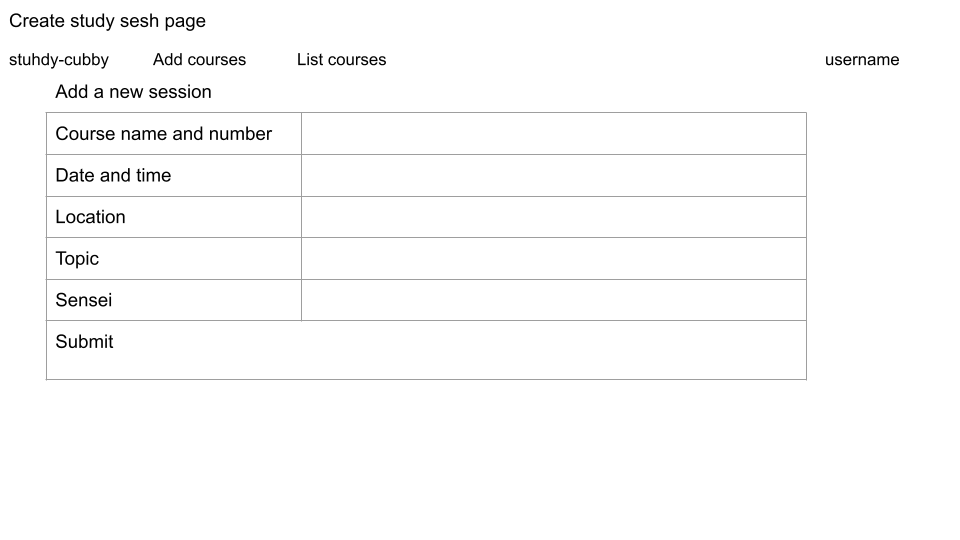
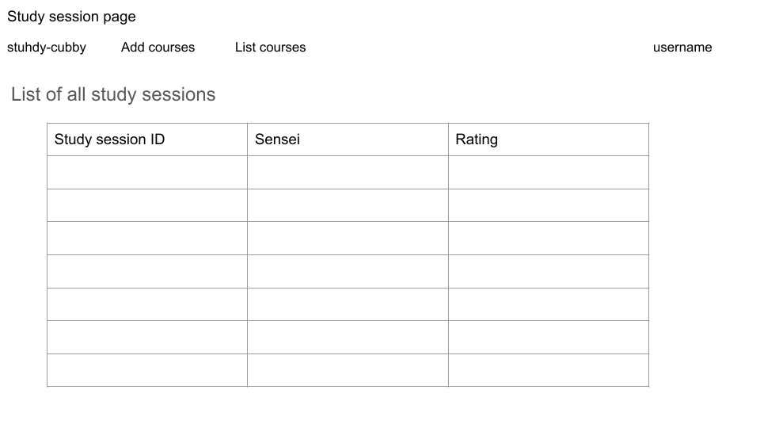

## Table of Contents
* [Overview](#overview)
* [User Guide](#user-guide)
* [Example Enhancements](#example-enhancements)
* [Community Feedback](#community-feedback)
* [Team](#team)

## Overview
### The Problem
ICS students often spend more time than they need on their homework and don’t learn the material as effectively as they could, because they study alone and do not leverage the power of face-to-face study groups with peer mentors.

### The Solution
stuhdy cubby is an application for UHM ICS students to self-organize face-to-face study groups around a course and/or specific homework or project topic.

# User Guide
### Landing page

### User home page

### Admin home page

### User profile page

### Calendar page

### Create Study Sesh page

### Study session page

### Game mechanic page(s) (for example, a leaderboard?)

## Example Enhancements
* Text message interface. See notifications, and reply to confirm attendance all through text message.
* Slack integration to facilitate notification and organization of meetings.
* A Slack Bot to suggest and help implement Study Buddy meetings.
* A rating system for meetings and sensei participation.

## Community Feedback
We are interested in your experience using stuhdy cubby! If you would like, please contact the team to provide feedback on the project.

## Team
stuhdy cubby is designed, implemented, and maintained by Susan Ma, Yhanessa Sales, and Christine Ramos.
