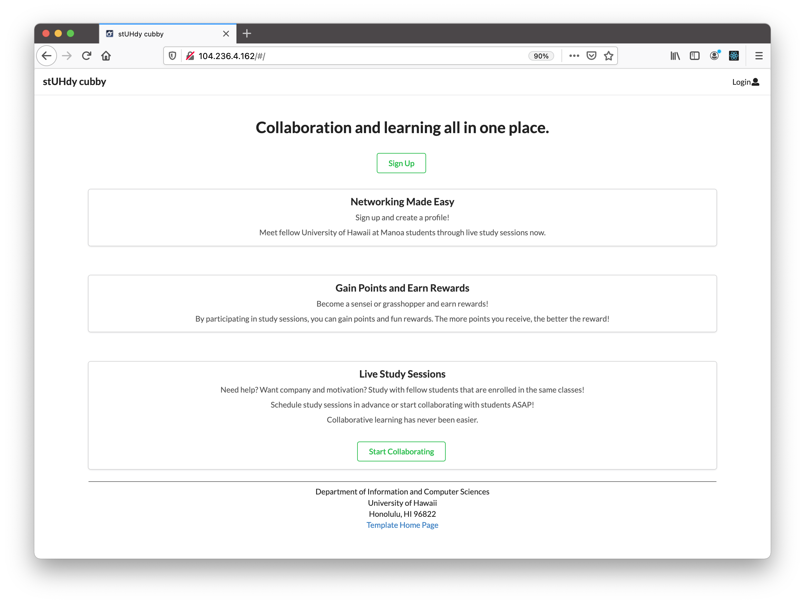
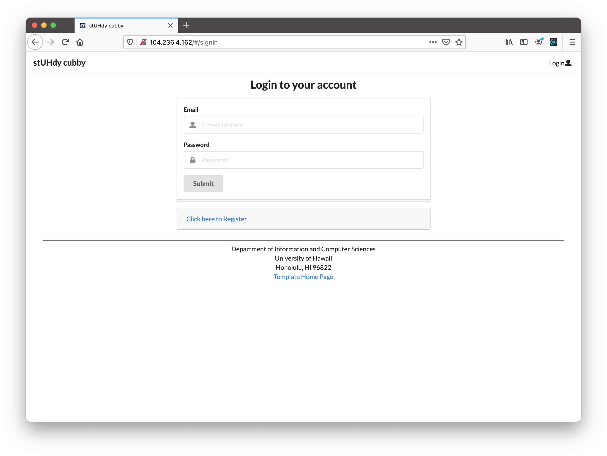
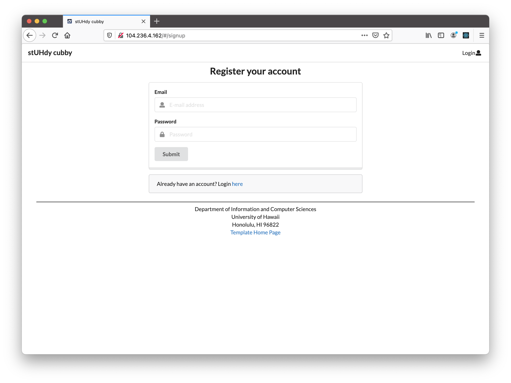
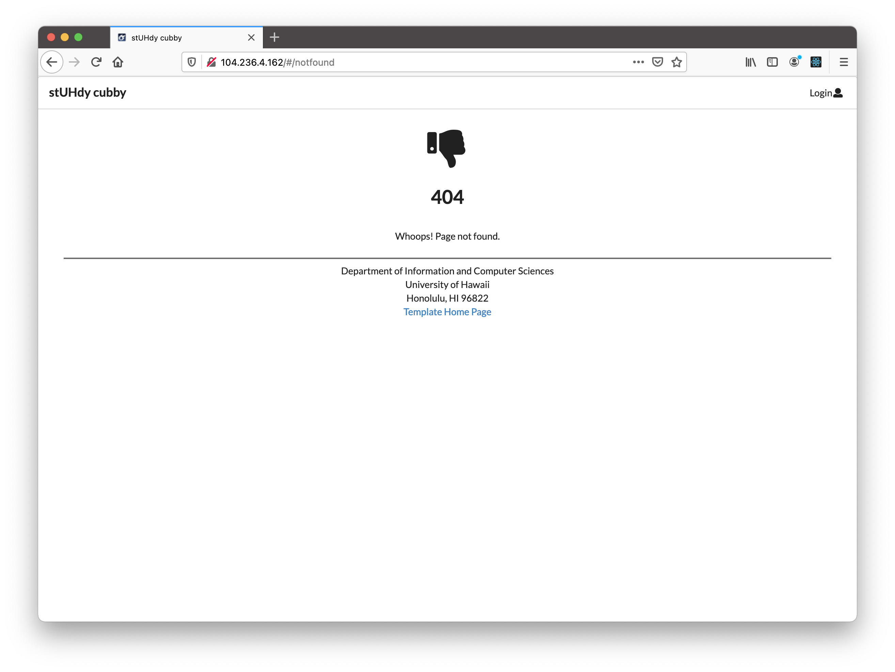
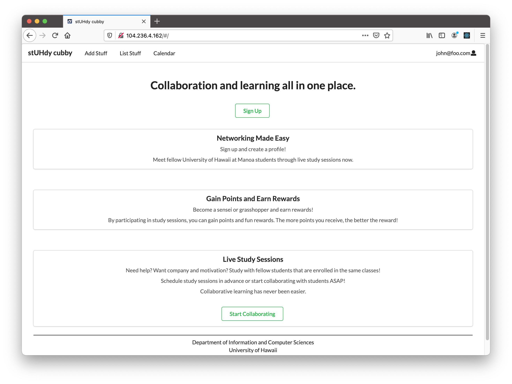
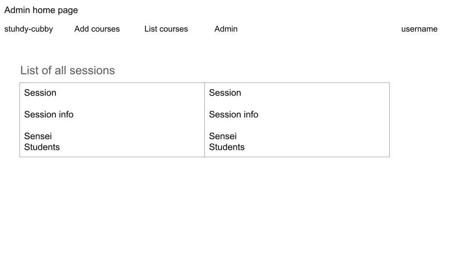
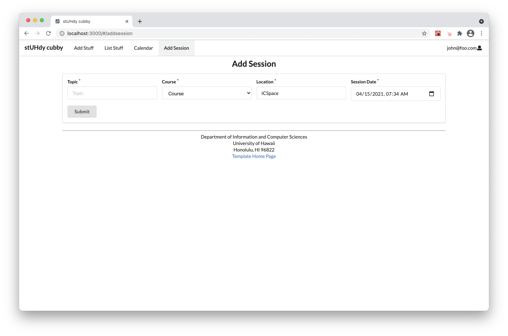
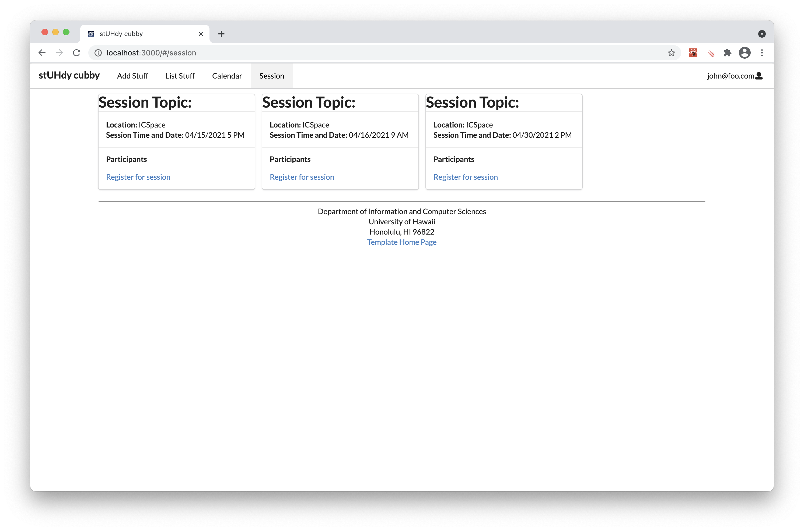
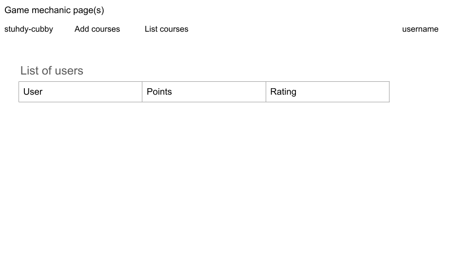

# stUHdy cubby

## Table of Contents
* [Overview](#overview)
* [Deployment](#deployment)
* [User Guide](#user-guide)
* [Example Enhancements](#example-enhancements)
* [Development History](#development-history)
* [Community Feedback](#community-feedback)
* [Team](#team)

## Overview
### The Problem
ICS students often spend more time than they need on their homework and don’t learn the material as effectively as they could, because they study alone and do not leverage the power of face-to-face study groups with peer mentors.

### The Solution
stuhdy cubby is an application for UHM ICS students to self-organize face-to-face study groups around a course and/or specific homework or project topic.

## Deployment
A live deployment of stUHdy cubby can be found at [http://104.236.4.162/#/](http://104.236.4.162/#/).

## User Guide
### Landing page

### Sign in page

### Sign up page

### 404 page

### User home page

### Admin home page

### User profile page

### Calendar page

### Create Study Sesh page

### Study session page

### Game mechanic page(s) (for example, a leaderboard?)

## Development History
The development process for stUHdy cubby conformed to [Issue Driven Project Management](http://courses.ics.hawaii.edu/ics314s21/morea/project-management/reading-guidelines-idpm.html) practices. In a nutshell:

* Development consists of a sequence of Milestones.
* Each Milestone is specified as a set of tasks.
* Each task is described using a GitHub Issue, and is assigned to a single developer to complete.
* Tasks should typically consist of work that can be completed in 2-4 days.
* The work for each task is accomplished with a git branch named “issue-XX”, where XX is replaced by the issue number.
* When a task is complete, its corresponding issue is closed and its corresponding git branch is merged into master.
* The state (todo, in progress, complete) of each task for a milestone is managed using a GitHub Project Board.
* The following sections document the development history of BowFolios.

### Milestone 1
The goal of Milestone 1 was to create a set of mockup pages providing an overall mockup of the project.

Milestone 1 was managed using [stUHdy cubby GitHub Project Board M1](https://github.com/stuhdy-cubby/stuhdy-cubby/projects/1):

### Project Board
[M1](https://github.com/stuhdy-cubby/stuhdy-cubby/projects/1)

[M2](https://github.com/stuhdy-cubby/stuhdy-cubby/projects/2)

## Example Enhancements
* Text message interface. See notifications, and reply to confirm attendance all through text message.
* Slack integration to facilitate notification and organization of meetings.
* A Slack Bot to suggest and help implement Study Buddy meetings.
* A rating system for meetings and sensei participation.

## Community Feedback
We are interested in your experience using stuhdy cubby! If you would like, please contact the team to provide feedback on the project.

## Team
stuhdy cubby is designed, implemented, and maintained by Susan Ma, Yhanessa Sales, and Christine Ramos.
